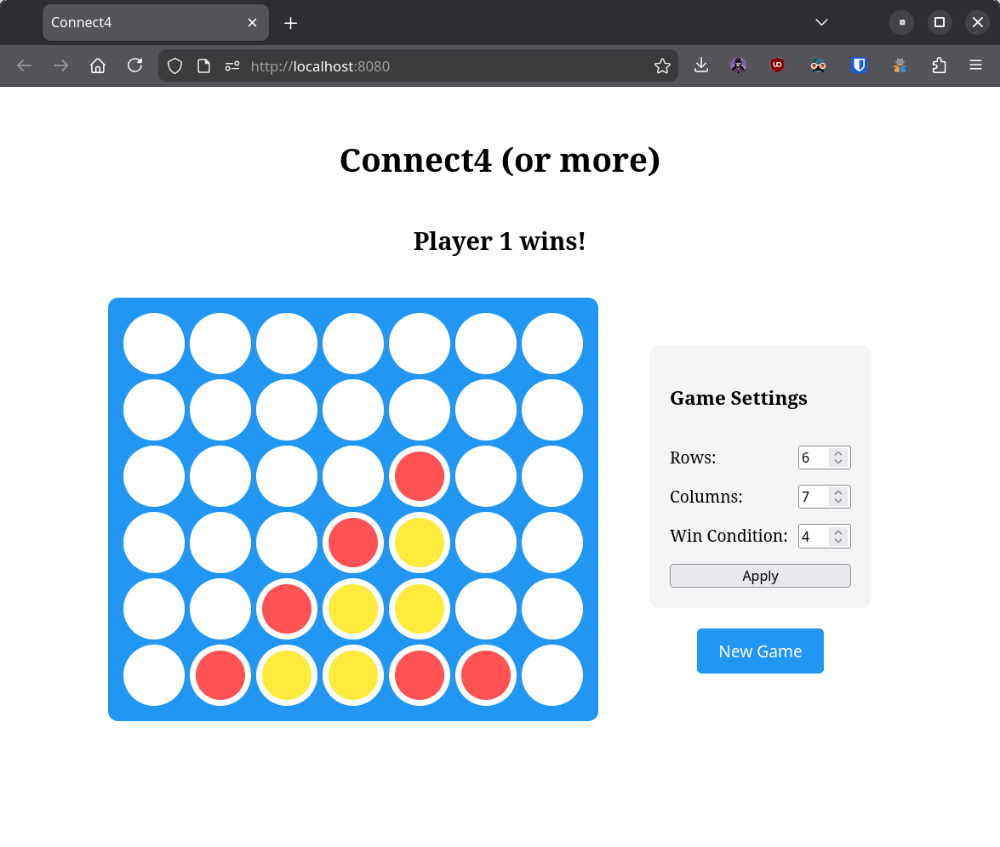
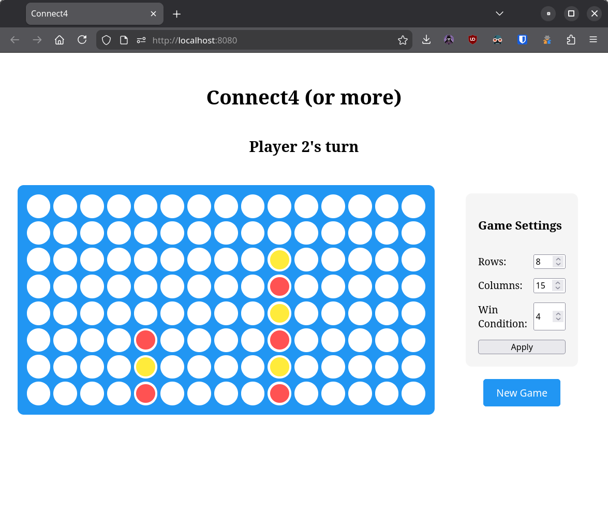
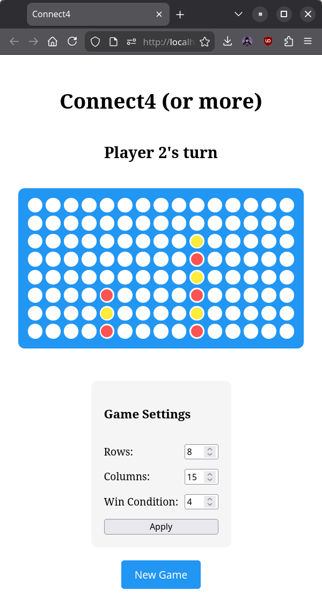

# Connect4 (or more)

| normal                         | large board                         | large board on small screen                      |
|--------------------------------|-------------------------------------|--------------------------------------------------|
|  |  |  |

## Running

```bash
./gradlew jsBrowserDevelopmentRun --continuous
```


## Notes

- `NumberInput` doesn't seem to respect min/max values on mobile, but works on desktop
- initial project structure based on [compose-multiplatform-html-library template](https://github.com/JetBrains/compose-multiplatform-html-library-template)


## UPDATES

1. so first of all this code got me into an interview
2. questions during interview:
   1. what parts of the task did you enjoy?
     - Kotlin data structures for board/state representation
     - Compose HTML DSL (similarities to Jetpack Compose/Multiplatform)
   2. how would you implement undo functionality?
     - (1st attempt) hold each historical board (so state at after each move)
       - (followup question) does it make sense from the memory footprint standpoint?
       - (followup answer) not always, but in this case board is small and games are short (**accepted explanation**)
     - (2nd attempt) hold only the differences between moves (so in which column was a piece dropped)
  3. let's implement the said functionality (the diff solution, logic only, no ui) - see `74aed6553ca88c9cbac2c3a3c0ab15152be25863` for implementation